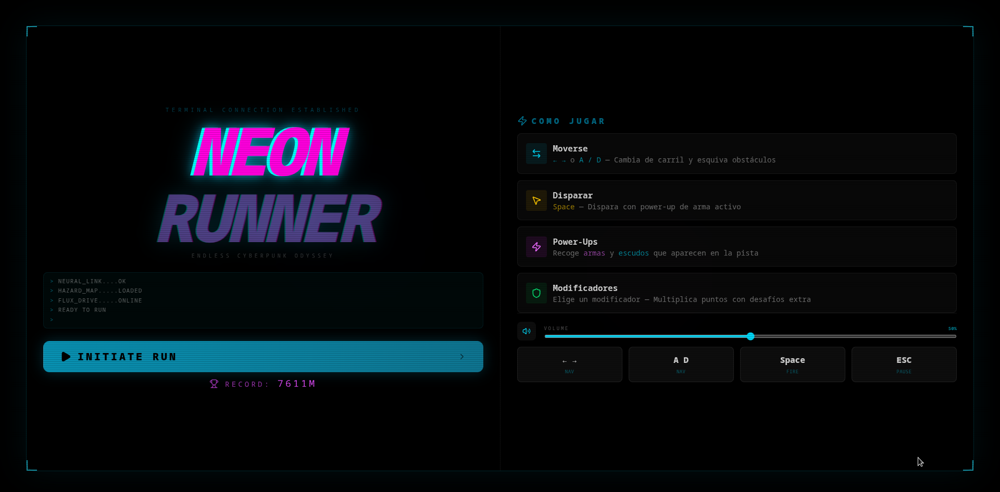
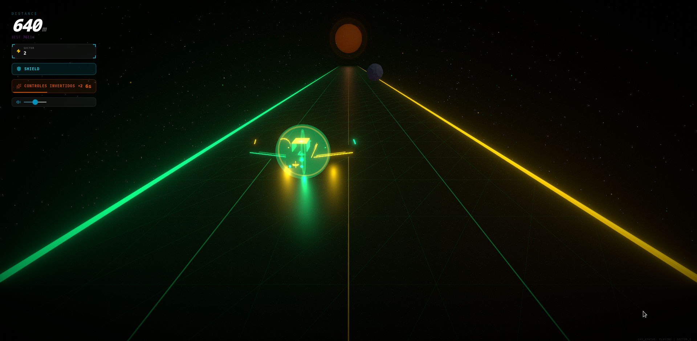
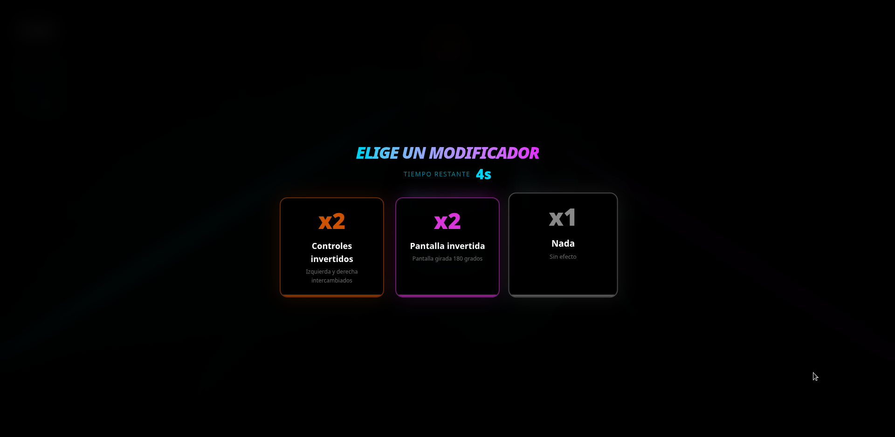
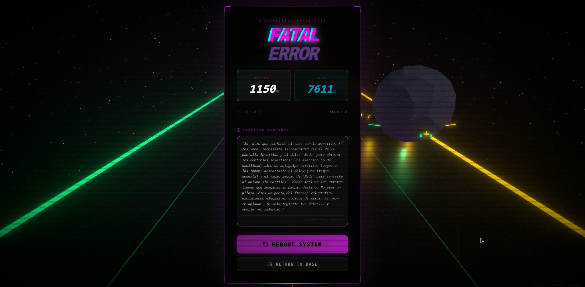

# Neon Runner 🎮

Un **endless runner 3D** con estética cyberpunk/synthwave construido con React, Three.js y Zustand. Esquiva obstáculos, recoge power-ups y elige modificadores de dificultad en tiempo real mientras la velocidad y el entorno evolucionan sin parar.

> **Demo en vivo:** http://vps23925.cubepath.net

## 📸 Capturas de Pantalla

| Pantalla Principal | Gameplay |
|---|---|
|  |  |

| Selector de Modificadores | Game Over |
|---|---|
|  |  |

## ✨ Características

- **Escena 3D inmersiva** con galaxia de partículas, sol retro synthwave, niebla volumétrica y efectos de post-procesado (bloom)
- **4 carriles** con obstáculos generados proceduralmente que aumentan en velocidad y frecuencia
- **Sistema de modificadores**: cada 500 puntos el juego se pausa y debes elegir entre 3 cartas de dificultad (controles invertidos, pantalla girada 180°, obstáculos parpadeantes, nave invisible, delay de input, doble tap, velocidad x2…) que multiplican tu puntuación
- **Power-ups coleccionables**: armas (disparo de proyectiles) y escudos temporales
- **Temas dinámicos**: la paleta de colores del escenario cambia cada 600 puntos entre 10 temas (Cyan/Magenta, Emerald/Gold, Crimson/Orange, Toxic Green, Monochrome…)
- **Efectos visuales**: screen flash, camera shake, speed lines, explosiones, overlay de scanlines CRT
- **Audio procedural**: efectos de sonido generados con Web Audio API + Howler (disparo, impacto, power-up, escudo, game over)
- **Análisis de decisiones con IA (Ollama)**: al finalizar cada partida, un modelo local de Ollama analiza las elecciones de modificadores del jugador y genera un perfil de riesgo con personalidad cyberpunk cínica y burlona
- **Persistencia local**: high score y últimas elecciones de modificadores guardados en `localStorage`
- **HUD completo**: puntuación, high score, velocidad, indicador de power-up/escudo, modificador activo con countdown
- **Controles**: teclado (A/D, flechas), swipe táctil y botones en pantalla para móvil

## 🛠️ Tecnologías

| Capa | Tecnología |
|---|---|
| Framework | React 19 + TypeScript |
| 3D / WebGL | Three.js + React Three Fiber + Drei |
| Post-procesado | @react-three/postprocessing |
| Estado | Zustand |
| UI | Tailwind CSS v4 + Motion (animaciones) + Lucide (iconos) |
| Audio | Howler + Web Audio API (procedural) |
| IA | Ollama (API compatible con OpenAI) — modelo `nemotron-3-super:cloud` para análisis de decisiones del jugador |
| Build | Vite 6 |

## 🚀 Cómo ejecutar localmente

```bash
# Instalar dependencias
npm install

# Servidor de desarrollo (puerto 3000)
npm run dev

# Build de producción
npm run build

# Previsualizar build
npm run preview

# Type-check
npm run lint
```

### Controles

| Acción | Teclado | Móvil |
|---|---|---|
| Mover izquierda | `A` / `←` | Swipe izquierda / botón |
| Mover derecha | `D` / `→` | Swipe derecha / botón |
| Disparar | `Espacio` | Botón de disparo |
| Pausar | `Esc` / `P` | — |
| Elegir modificador | `1` / `2` / `3` | Tap en la carta |

## ☁️ Despliegue en CubePath + Ollama

Este proyecto se despliega en **CubePath** aprovechando el build estático de Vite servido a través de Express, con integración de IA local mediante **Ollama**.

### Cómo se utilizó CubePath

1. **Registro**: Se creó una cuenta en [CubePath](https://midu.link/cubepath) obteniendo $15 de crédito gratuito, suficiente para levantar un servidor nano sin necesidad de tarjeta de crédito.

2. **Build de producción**: Se ejecuta `npm run build` para generar la carpeta `dist/` con todos los assets optimizados (JS, CSS, imágenes).

3. **Servidor Express**: Se incluye un `server.ts` que sirve los archivos estáticos generados por Vite, permitiendo que CubePath despliegue la aplicación como un servicio Node.js.

4. **Despliegue**: El repositorio se conecta a CubePath, que detecta el `package.json`, ejecuta `npm install` y `npm run build`, y luego arranca el servidor con `node server.ts`.

5. **Resultado**: La aplicación queda accesible públicamente en una URL de CubePath con HTTPS, lista para ser jugada desde cualquier navegador sin configuración adicional.

### Cómo se utilizó Ollama

Se integró **Ollama** como motor de IA local para generar un análisis personalizado de las decisiones del jugador al finalizar cada partida:

1. **Modelo utilizado**: `nemotron-3-super:cloud` ejecutado a través de la API compatible con OpenAI de Ollama (`http://localhost:11434/v1/chat/completions`).

2. **Funcionamiento**: El componente `DecisionLog.tsx` recopila todas las elecciones de modificadores que el jugador hizo durante la partida (qué cartas eligió, a qué puntuación, qué alternativas descartó) y envía un prompt al modelo de Ollama pidiéndole un perfil de riesgo con personalidad cyberpunk cínica y burlona.

3. **Prompt del sistema**: El modelo actúa como un "supervisor de IA cyberpunk" que analiza si el jugador buscó la adrenalina con desafíos difíciles o eligió el camino fácil ("Nada"), generando un comentario filosófico y burlón sobre su estrategia de juego y valor como piloto.

4. **Formato de respuesta**: Se solicita respuesta en formato JSON (`response_format: { type: 'json_object' }`) con un campo `message` que contiene el análisis, parseado directamente en el componente React.

5. **Fallback y retry**: La función `callAI` en `src/utils/ai.ts` implementa reintentos automáticos (hasta 3) y manejo de errores para garantizar que el análisis se muestre incluso en condiciones de red inestables.

6. **Configuración**: La URL base del modelo se configura mediante `VITE_MODAL_BASE_URL` en el `.env`, con fallback a `http://localhost:11434/v1/`. No requiere API key ya que Ollama corre localmente.

## 📂 Estructura del proyecto

```
src/
├── App.tsx                  # Componente raíz, Canvas Three.js, ErrorBoundary
├── main.tsx                 # Punto de entrada, global error handler
├── types.ts                 # Interfaces y tipos TypeScript compartidos
├── index.css                # Tailwind import + estilos globales
├── store/
│   └── gameStore.ts         # Zustand store (todo el estado + lógica del juego)
├── hooks/
│   └── useAudio.ts          # Hook de audio (Howler + Web Audio API)
├── audio/
│   └── sfx.ts               # SFX procedurales (shoot, hit, powerup, game over)
└── components/game/
    ├── Player.tsx           # Nave del jugador
    ├── Road.tsx             # Carretera con líneas de carril
    ├── Obstacles.tsx        # Obstáculos 3D
    ├── PowerUp.tsx          # Sistema de power-ups (arma + escudo)
    ├── Projectiles.tsx      # Proyectiles
    ├── Effects.tsx          # Post-procesado (bloom, etc.)
    ├── Galaxy.tsx           # Fondo de galaxia con partículas
    ├── Sun.tsx              # Sol retro estilo synthwave
    ├── HUD.tsx              # Interfaz de puntuación y estado
    ├── StartScreen.tsx      # Pantalla de inicio
    ├── ModifierCards.tsx    # Selector de modificadores
    ├── CameraShake.tsx      # Efecto de sacudida de cámara
    ├── Explosions.tsx       # Sistema de explosiones
    ├── SpeedLines.tsx       # Líneas de velocidad
    └── DecisionLog.tsx      # Log de decisiones de modificadores
```

## 📜 Cumplimiento de reglas de la Hackatón

- ✅ Desplegado en CubePath
- ✅ Proyecto nuevo (sin usuarios reales previos)
- ✅ Repositorio público con demo accesible
- ✅ Documentación completa: descripción, enlace a demo, capturas de pantalla y explicación de CubePath
- ✅ Proyecto funcional al momento de la revisión

---

*Hecho para la Hackatón CubePath 2026*
